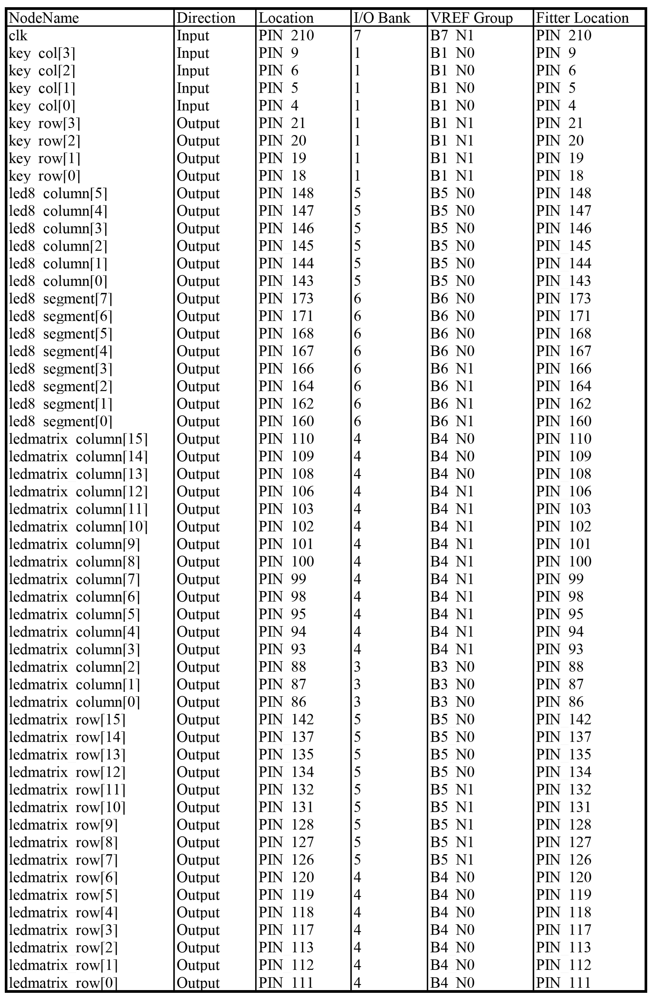

# MatrixCalculator
MatrixCalculator 矩阵计算器——硬件描述语言课程设计

- 项目基于HDLE-2硬件描述语言综合实验平台

- 使用VHDL语言编写

- matrix_calculator文件夹为工程源文件，引脚配置在最后

  

## 设计思路

采用模块化设计的思想，将工程细分为多个子模块，降低各部分之间的耦合，便于往后的调试与修改。下图为模块设计方案。

​                   

### 1、中心逻辑控制模块

**功能描述：**

通过键盘反馈的信号进行中央逻辑控制，进行逻辑运算与显示控制，控制LED数码管和LED点阵显示。

**端口说明：**

| **端口名**       | **方向** | **数据类型**                   | **说明**   |
| ---------------- | -------- | ------------------------------ | ---------- |
| clk              | IN       | STD_LOGIC                      | 板载时钟   |
| key_row          | BUFFER   | STD_LOGIC_VECTOR(3  DOWNTO 0)  | 键盘行选   |
| key_col          | IN       | STD_LOGIC_VECTOR(3  DOWNTO 0)  | 键盘列选   |
| led8_column      | BUFFER   | STD_LOGIC_VECTOR(5  DOWNTO 0)  | 数码管行选 |
| led8_segment     | OUT      | STD_LOGIC_VECTOR(7  DOWNTO 0)  | 数码管段选 |
| ledmatrix_row    | BUFFER   | STD_LOGIC_VECTOR(15  DOWNTO 0) | 点阵行选   |
| ledmatrix_column | BUFFER   | STD_LOGIC_VECTOR(15  DOWNTO 0) | 点阵列选   |

**关键信号定义：**

| **信号名**                | **说明**                        |
| ------------------------- | ------------------------------- |
| key_value                 | 键盘反馈的按键信号              |
| display_led8_numbers      | 输出给数码管显示模块的显示信号  |
| display_ledmatrix_numbers | 输出给LED显示模块的显示信号     |
| cursor                    | 输出给LED显示模块的光标位置信号 |

**具体实现思路：**

得到键盘的反馈信号key_value后，通过判断哪个键被按下，执行相关的操作。

进行输入操作时,通过光标位置判断输入的是矩阵的什么位置的元素，改变display_ledmatrix_numbers的相应位置的值并显示；

进行运算操作时，运算将改变display_ledmatrix_numbers（转置）或display_led8_numbers（行列式，模方）进行运算结果的显示。

display_ledmatrix_numbers和display_led8_numbers是自定义类型的数组，无法传入子模块，所以进行BCD编码后传入子模块。

 

### 2、键盘控制模块

**功能描述：**

通过键盘扫描电路判断键盘状态并完成去抖，返回键码信号值。

**按键功能说明：**

**端口说明：**

| **端口名** | **方向** | **数据类型**                  | **说明** |
| ---------- | -------- | ----------------------------- | -------- |
| clk        | IN       | STD_LOGIC                     | 板载时钟 |
| key_row    | BUFFER   | STD_LOGIC_VECTOR(3  DOWNTO 0) | 键盘行选 |
| key_col    | IN       | STD_LOGIC_VECTOR(3  DOWNTO 0) | 键盘列选 |
| key_value  | OUT      | STD_LOGIC_VECTOR(4  DOWNTO 0) | 返回键码 |

**键盘扫描：**

  设置键盘扫描时钟，电路在键盘扫描时钟的激励下，不断扫描每一行的按键值并保存，当一轮扫描完成后，通过判断保存下来的四行按键值即可得出哪个键被按下，并返回相应的键码。

**去除抖动：**

设置一个2ms的计数器，当2ms内键码保持稳定时，输出一个扫描时钟周期的有效键码，该方法可以有效的去除抖动，并保证在一个按键按下时，只会输出一个周期的有效键码。

 

### 3、LED点阵显示控制模块

**功能描述：**

接受显示的矩阵数字以及光标位置，生成显示矩阵，进行刷新显示。

**端口说明：**

| **端口名**       | **方向** | **数据类型**                   | **说明** |
| ---------------- | -------- | ------------------------------ | -------- |
| clk              | IN       | STD_LOGIC                      | 板载时钟 |
| ledmatrix_row    | BUFFER   | STD_LOGIC_VECTOR(15  DOWNTO 0) | 点阵行选 |
| ledmatrix_column | BUFFER   | STD_LOGIC_VECTOR(15  DOWNTO 0) | 点阵列选 |
| display_numbers  | IN       | STD_LOGIC_VECTOR(0  TO 15)     | 显示码   |
| cursor           | IN       | INTEGER                        | 光标位置 |

**具体实现：**

将0-9的字模存在常量中，通过中心控制电路给予的显示信号，动态调整键盘显示内容。

其中第7行和第15行为光标显示的位置。通过cursor调整光标的显示位置，进行闪烁。确定好矩阵显示内容后，进行刷新显示显示矩阵中的内容。

### 4、LED数码管显示控制模块

**功能描述：**

接受显示的六位字符，控制数码管刷新显示

**端口说明：**

| **端口名**      | **方向** | **数据类型**                  | **说明**   |
| --------------- | -------- | ----------------------------- | ---------- |
| clk             | IN       | STD_LOGIC                     | 板载时钟   |
| led8_column     | BUFFER   | STD_LOGIC_VECTOR(5  DOWNTO 0) | 数码管行选 |
| led8_segment    | OUT      | STD_LOGIC_VECTOR(7  DOWNTO 0) | 数码管段选 |
| display_numbers | IN       | STD_LOGIC_VECTOR(0  TO 23)    | 显示码     |

**具体实现：**

将0-9的段码存在常量中，通过中心控制电路给予的显示信号，调整显示序列，进行刷新显示。

## 演示效果

开机：

移动光标进行输入：

转置运算：

行列式运算：

模方运算：

## 引脚配置

